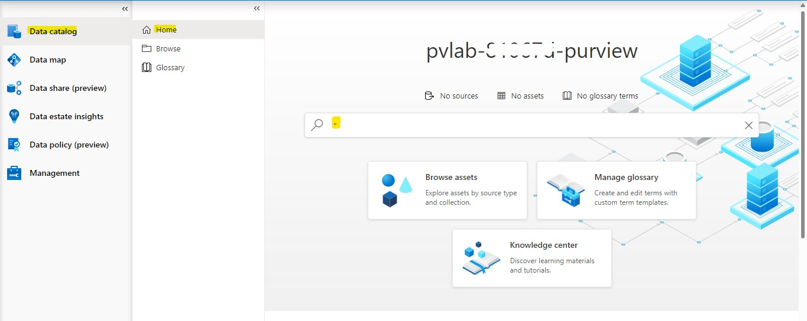
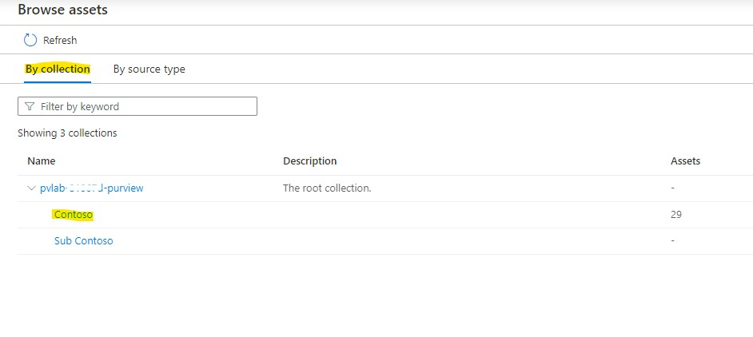
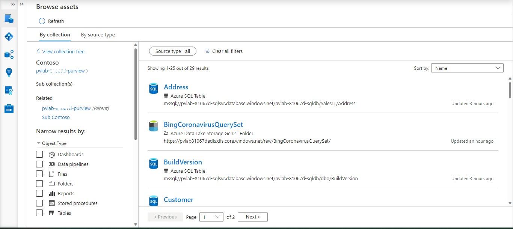
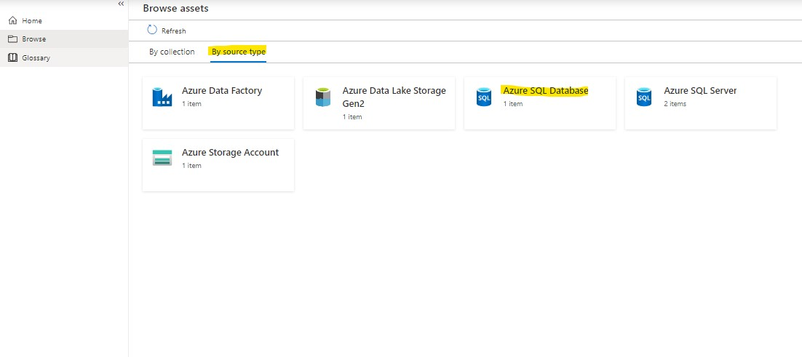
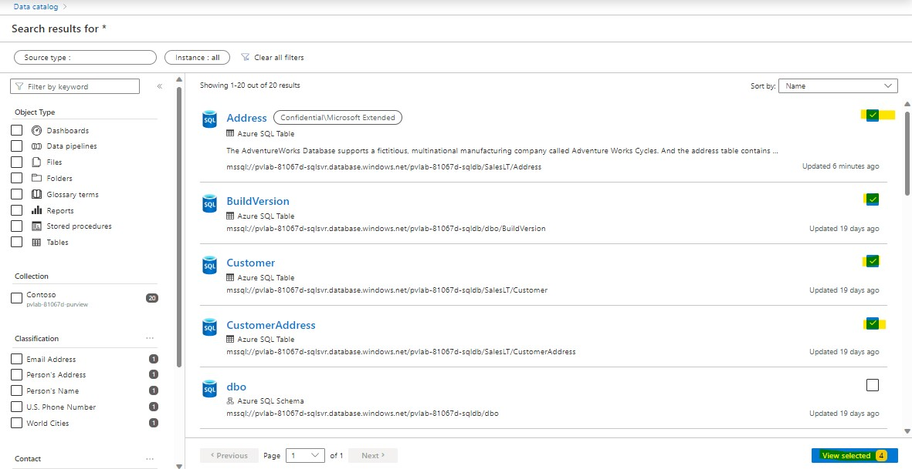
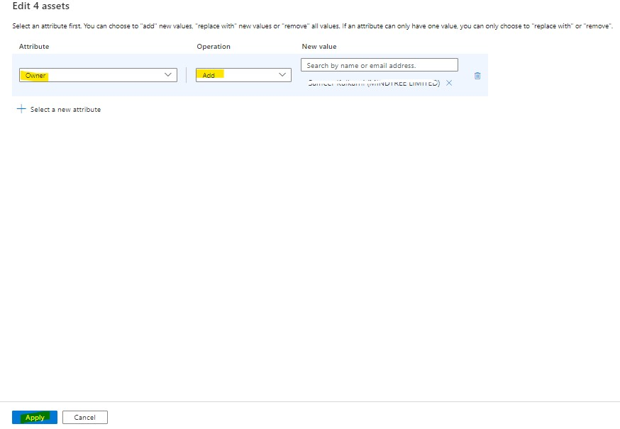
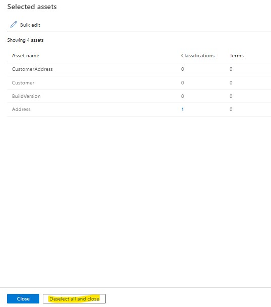

# Searching and Editing Assets

Once sources have been registered and scanned, the underlying data catalog will begin to populate with assets that represent real-world objects (e.g. a table in an Azure SQL Database, a Power BI report, etc.) The surfacing of these assets via Microsoft Purview's search experience helps empower data consumers to find data assets that matters to them.

In this module, you'll learn to edit technical metadata by adding definitions and classifications to data attributes, such as tables and columns. You'll learn to assign technical ownership by linking technical attributes to contact persons. You'll learn to use classifications to mark data. All these activities, such as categorizing data, will help you to better manage your data.

## Prerequisites
*	An Azure account with an active subscription.
*	An Azure Purview account (covered in Create an Azure Purview Account Demo) 
*	Relevant data sources are registered and scanned in Azure Purview and underlying data catalog has been populated. 

## Objectives
* Search the catalog by keyword.
* Browse the catalog by source.
* Update an existing asset.
* Perform a bulk edit operation.

## 1. Search Catalog
1. Open the **Microsoft Purview Governance Portal**, navigate to **Data Catalog** > **Home**, type the asterisk character (**\***) into the search bar, and hit **Enter**.

  
  
2. Click the hyperlinked asset name to view the details (e.g. `Address`).

  
  

## 2. Update an Asset
1. Click **Edit** to modify the asset details.

    
    
2. Update the **Description** by copying and pasting the sample text below.

    ```text
    The AdventureWorks Database supports a fictitious, multinational manufacturing company called Adventure Works Cycles. And the address table contains the customer's address.
    ```
    
3. Assign a **Classification** (e.g. `Person's Address`) using the drop-down menu.

    
    
4. Navigate to the **Schema** tab and update the **Asset description** for each column using the sample text below.

    
    
    **AddressID**

    ```text
    Primary key for Address records.
    ```

    **AddressLine1**

    ```text
    First street address line.
    ```

    **AddressLine2**

    ```text
    Second street address line.
    ```

    **City**

    ```text
    Name of the city.
    ```

    **CountryRegion**
    
    ```text
    Name of the country.
    ```

    **ModifiedDate**

    ```text
    Date and time the record was last updated.
    ```
    
    **PostalCode**
    
    ```text
    Postal code for the street address.
    ```

    **rowguid**
    
    ```text
    ROWGUIDCOL number uniquely identifying the record. Used to support a merge replication sample.
    ```

    **StateProvince**
    
    ```text
    Unique identification number for the state or province. Foreign key to StateProvince table.
    ```

5. Navigate to the **Contacts** tab and set someone within your organization to be an **Expert** and an **Owner**. Click **Save**.
  
    
    
6. To see other assets within the same path, navigate to the **Related** tab.

    
    
 
## 3. Browse Assets

While the search experience is ideal for keyword based discovery, the Microsoft Purview Governance Portal allows alternate methods of browsing assets (i.e. by collection OR by source type).

1. Open the **Microsoft Purview Governance Portal**, click on  **Browse assets** in the homepage.

    
    
2. On the **Browse asset page**, select **By collection pivot**. Collections are listed with hierarchical table view. To further explore assets in each collection, select the corresponding collection name.

    

3. On the next page, the search results of the assets under selected collection will show up. You can narrow the results by selecting the filters. Or you can see the assets under other collections by selecting the sub/related collection names.
    
    
    
4. Switch to the **By source type** tab and select a **source** (e.g. `Azure SQL Database`).

    
    
5. Select an **account** (e.g. `pvlab-{randomId}-sqldb`). 

    

6. Select a **database** (e.g. `SalesLT`).

    
    
## 4. Bulk Edit
Microsoft Purview allows us to perform certain operations (add/replace/remove) against a subset of attributes (Expert, Owner, Term, Classification) in bulk directly within the Microsoft Purview Governance Portal.

1. Open the **Microsoft Purview Governance Portal**, navigate to **Data Catalog** > **Home**, type the asterisk character (**\***) into the search bar, and hit **Enter**.

    

2. Hover your mouse over an item in the list to reveal the checkbox on the right-hand side. Select four items and click **View selected**.

    

3. Click **Bulk edit**.

    

4. Set the **Attribute** to `Owner`, set **Operation** to `Add`, select one or more users in your organization, and click **Apply**.

    

5. Click **Deselect all and close**.

    


  [ ⏮️ Previous Module](../03_registering-and-scanning-an-on-premises-sql-server-instance/documentation.md) 
